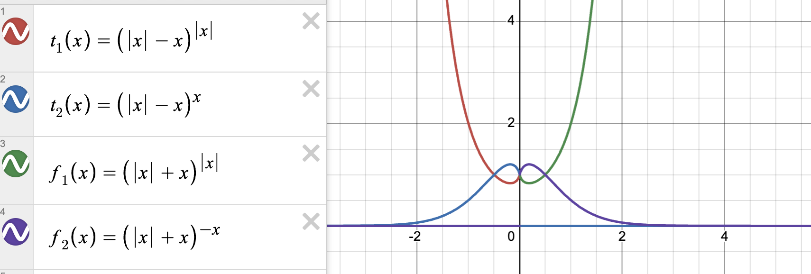

# Arithmetics ↔ Boolean algebra

We often use certain mathematical functions without knowing how they can be derived mathematically. When looking up definitions for functions, they often either have circular dependencies, meaning that they are implicitly defined, or that they use notation that seems to skip or obfuscate important steps to derive them. An example can be how the piecewise notation can be expressed algebraically (which is important).

Why would this be interesting? Well, it's interesting to me because it answers questions that I've had for a while.

But for most of you, it might be more interesting if we talk about it in the context of neural networks. So I have 3 open questions below that I will try to answer in this project: 

1. If you'd think of creating a neural network that, in simple terms, use additive and multiplicative operations in higher dimensions, wanting it to learn how to algorithmically produce mathematical functions; how would one represent them using, for example, "pure" mathematical notation?

2. We all know about the Universal approximation theorem that states that for any function $f(x)$ there exists a subset of neural networks that can approximate that function. So how could one explicitally express a higher mathematical functions through "pure" addition/subtraction/multiplication/division operations?

3. If we take a look at how computers have implemented these functions, we see that they are defined in ways that exploit the structural representation of numbers, which are integer/floating-point binary sequences. So if we instead start with decimal digit sequences, and only use the tools that I've specified below, how would functions like $max(a, b)$, $a \lt x$, piecewise notation or $a\ mod\ b$ be written such that they stay congruent with their binary counterpart?

So the **goal** of this project is to see if it's possible to define mathematical functions with **Arithmetic operations**, **Algebraic expressions**, and **Finite Series and Sequences**. These things should be derivable given that we can derive boolean algebra.

I'm almost certain that there is literature about this in *Number theory*, *Discrete Mathematics*, *Combinatorics* or *Theoretical Computer Science*, but I'm not sure it has been posed in this way before because I haven't found anything that directly organised it this way.

#### Toolkit
So we will be using arithmetic additive and multiplicative operations, powers, roots and logarithms, finite summation and product series notation $\Sigma$ and $\Pi$, and limits $\lim_{x \to a}$ to derive integration and derivation $\int$ and $\frac{d}{dx}$. They need to be expressed algebraically.

#### Elements
We use Reals and Complex numbers in decimal base system.

#### Quick notes
Most of these operations and functions work because of infinite series.
So to make this computable we should define a maximum number length so that we know how to specify the series so that they correctly converges. 

For periodic functions we also would use range reduction.

*The base formulas are defined at the bottom*.

#### Irreducibility
When starting to formalise these expressions you sometimes discover cases where some expressions cannot be simplified (reduced) anymore, because then they'd lose their unique property. So those expressions often get their own math notation.

### Important operations
So I've noticed that there are some operations and functions that are necessary for other things to be derivable. 

1. The first one is the absolute function. It has two properties (there are more though), idempotence and symmetric. Note that if we have a complex number $|z|$ would be interpreted as $\sqrt{a^2 + b^2}$. But here we say it's $\sqrt{x^2}$, which then would mean that $\sqrt{(-(real + imaginary))^2} = real + imaginary$.

$$|x|=\sqrt{x^2}$$

3. The second one uses uses the $0^{0}=1$ interpretation, which is important because it gives rise to $(|x| - x)^{|x|}(|x| - x)^{x}$ and $(|x| + x)^{|x|}(|x| + x)^{-x}$, which simplifies to $0^{|x| + x}$ and $0^{|x| - x}$. The power rule states that $0^{x > 0} = 0$, and $0^{x = 0} = 1$. It's important to note that $0^{0}$ is actually indeterminate, and has different definitions depending on the context. In combinatorics, it is defined as being equal to one, but using limits, one could argue for it being equal to either 1 or 0.

$$(|x| - x)^{|x|}(|x| - x)^{x}=(|x| - x)^{x}(|x| - x)^{|x|}=(|x| - x)^{|x|\ +\ x}=0^{|x|\ +\ x}$$

$$\text{\textit{off}}\ (x) = 0^{|x|+x} = \begin{cases} 0 & \text{if } x > 0 \\
1 & \text{if } x \leq   0\end{cases}$$

$$on(x) = 1 - \text{\textit{off}}\ (x) = \begin{cases} 1 & \text{if } x > 0 \\
0 & \text{if } x \leq   0\end{cases}$$

 >I've later discovered that these functions I'm defining here are often called **step function, heaviside function, boxcar function**, but they define it differently.
 >They are often defined using piecewise notation. The main difference here is that I'm saying that 0 is part of the negative number line and that I have an explicit definition of it.

### Circular functions
I would like to begin by introducing alternative ways to define functions that are implicitly defined, meaning in this case that they have circular dependencies. 

Let me give you an example. Take the Modulo function. Its definition includes the Absolute- and the Floor function. But how are they defined?

The *mod/floor/ceil/fraction* functions are always based on eachother, which makes it a little frustrating to define them using our method. But after playing around with trigonometric functions, I've managed to find out that we only need to define the *modulo* operation, and the rest can be derived from it. Took me a while to figure this out..

Lets define it as: 

$$mod(x, y) = \frac{y\times\cot^{-1}(\cot(\frac{\pi x}{y}))}{\pi}$$
>This function can not be found anywhere on the internet and is very important in our case, because it's the building block for many of the following functions.

>There are alternative ways to define this also. See further down.

We can now define: 

$$ \lbrace x \rbrace = frac(x) = mod(x, 1)$$

> This will give us the faction part.

We can also define $trunc(x)$:

$$trunc(x) = x - sign(x) \cdot mod(|x|, 1)$$
> $sign(x)$ is defined in the logical expressions section.

So with this, we can define the $\lfloor x \rfloor$ function.

Lets define it as: 

$$\lfloor x \rfloor = floor(x) = x - \lbrace x \rbrace$$

We can also define the $\lceil x \rceil$ function now.

Lets define it as: 

$$\lceil x \rceil = ceil(x) = x +  \lbrace -x \rbrace$$

We can also define $round(x)$, both up and down.

Let us define it as: 

$$roundUp(x) = \lfloor x + 0.5 \rfloor$$

Let us define it as: 

$$roundDown(x) = \lceil x - 0.5 \rceil$$

We can also define the $isFraction(x)$ function.

Lets define it as:

$$isFraction(x) = \lceil x \rceil - \lfloor x \rfloor$$

We define the $length(x)$ function, which gives us the integer length of a number.

Lets define it as: 

$$length(x) = \lfloor \log_{10}(|x|) \rfloor + 1$$
> Note that we need to specify a MAX fraction size if we want to be able to count the number length of fractions/decimals.

We can define the $digitAt(x, pos) = number_{position}$, which gives us the integer number at position.

Lets define it as: 

$$digitAt(x, pos) = \lfloor \frac{\lfloor x - \lfloor \frac{x}{10^{pos}} \rfloor \cdot 10^{pos} \rfloor}{10^{pos - 1}} \rfloor$$

> Important, I've seen that $\lfloor \frac{x}{10^{pos - 1}} \rfloor \bmod 10$ doesn't give accurate digits when working with contiguous bit sequences, so I would use my version instead.

### Boolean Functions and Logical Operations
We can now move over to more logical operations.

We can also define it as this:

$$ \text{\textit{off}}\ (-x) = 0.5 + \frac{|x - mod(x, 1) + 0.5|}{2x - 2 \times mod(x, 1) + 1}$$

>This would actually require $(|x|\ -\ x)^{|x|\ +\ x}$ because *mod* (arccot to be specific) uses piecewise notation.

We can also define the $sign(x)$ function. Its codomain looks like this:

$$sign(x) = (-1)^{on(-x)} = \frac{x}{|x|} = \begin{cases} +1 & \text{if } x \geq   0 \\
-1 & \text{if } x < 0 \end{cases}$$
> Usually there is a third case here for zero, but I interpret that as being positive instead of just zero.

So next up is to define the basic $not(x)$, $and(x, y)$, and $or(x, y)$.

Let us define: 

$$not(x) = 1 - on(x) = on(\text{\textit{off}}\ (x))$$

$$and(x, y) = on(x) \times on(y)$$

$$or(x, y) = not(and(not(x), not(y)))$$

$$xor(x, y) = or(and(not(x), y), and(x, not(y)))$$

The $max(a, b)$ function can easily be defined using the previous logic operations.

Let us define it as:

$$max(a, b) = a\cdot on\left(a\ -\ b\right)\ +\ b\cdot\left(1\ -\ on\left(a\ -\ b\right)\right)$$

and the $min(a, b)$ function can then just switch the arguments around.

$$min(a, b) = b\cdot on\left(a\ -\ b\right)\ +\ a\cdot\left(1\ -\ on\left(a\ -\ b\right)\right)$$

Let's do *Greater than*, *Lesser than* / *or equal*.

Greater than or equal:

$$x \geq a = gte(x, a) = 0^{\left|a\ -\ \min\left(x,\ a\right)\right|}$$

Lesser than or equal:

$$x \leq a = lte(x, a) = 0^{\left|a\ -\ \max\left(x,\ a\right)\right|}$$

Greater than:

$$x \gt a = gt(x, a) = 1-lte(x, a)$$

Lesser than:

$$x < a = lt(x, a) = 1-gte(x, a)$$

... we can go on and on...

Open interval:

$$between(x, a, b) = a < x < b = 0^{|on(x - a) - on(-x - b)|} = on(x - a) - 0^{|(x - b)| - (x-b)} =\begin{cases} 1 & \text{if } a \lt x \lt b \\ 
0 & \text{else }\end{cases}$$

Half-open interval:

$$ = \lbrack\ a,\ b\ \rparen (x) = gte(x, a) \times lt(x, b) \times x$$

We can do a binary counting function:

$$fromBinaryToDecimal(x)=\sum_{n=0}^{length(x)} on(digitAt(x, n + 1)) \cdot 2^{n}$$

$$fromBinaryToDecimal(1010101) = 85$$

We can do a binary16 (IEEE Standard for Floating-Point Arithmetic) to decimal:

$$ fromBinary16ToDecimal(x) = \left(-1\right)^{digitAt\left(x,\ 16\right)} \cdot 2^{^+\langle digitAt\left(x,\ 11\ +\ n\right)\cdot2^{n} \rangle_{n=0}^{4}-15} \cdot \left(1\ +\ \sum_{n=0}^{9}digitAt\left(x,\ 10\ -\ n\right)\cdot2^{-\left(n\ +\ 1\right)}\right)$$

$$fromBinary16ToDecimal(0100001100000000) = 3.5$$

> This is just a proof of concept for turning a binary sequence number only containing 1 and 0 into a decimal number.

$$rect(x) = on(x + 0.5) \cdot off(x - 0.5)$$

$$round(x) = \sum_{k=-\infty}^{\infty}k\ \cdot\ rect\left(x-k\right)$$

$$ precision(x, p) = on(x + p) \cdot off(x - (1 - p)) $$

$$floor(x) = \sum_{k=-\infty}^{\infty}k\ \cdot\ precision\left(x-k, 0.001\right)$$

$$w^{x} \equiv 0^{|x| - x}$$

$$floor(x) = \sum_{k=-\infty}^{\infty}k[w^{x - k} - w^{x - k - 1}]$$

This is my own notation for sigma notation.

$^+\langle k[w^{x - k} - w^{x - k - 1}] \rangle _{k\ =\ -\infty}^{\infty}$

$^+\overset{k\ =\ \overset{-}{\infty}\ \to\ \overset{+}{\infty}}{\langle k[w^{x - k} - w^{x - k - 1}] \rangle}$

### Piecewise functions

But now we can do Piecewise functions with "pure" math.

$$f(x) = between(x, 0, 4) \times x^{2} + between(x, 3, 6) \times x^{3}$$

....

### Special Fourier series

Rectangular function can be defined using the logical operations above. But it's also possible to define it using a logistic function IIF we have defined $\frac{x}{0} = \infty$, and $\frac{x}{\infty} = 0$.

$$rect(x) = \frac{1}{1 + 0^{x + 0.5}} - \frac{1}{1 + 0^{x - 0.5}}$$

----------------------

### Base formulas 

> NOTE: There're certain Analytical continuations for certain functions, but that's not the point of this.

$$ln(x) = 2 \times \sum_{n=0}^{\infty} \frac{1}{2n + 1}(\frac{x - 1}{x + 1})^{2n+1}$$

$$e^{x} = \sum_{n=0}^{\infty} \frac{x^{n}}{n!}$$

$$b^{x} = e^{x \times ln(b)}$$

$$x! = \lim_{N \to \infty} N^x\prod^{N}_{k=1} \frac{k}{k + x}$$

$$sin(x) = \sum_{n=0}^{\infty} \frac{(-1)^{n}}{(2n + 1)!} x^{2n + 1} = \frac{x}{(\frac{x}{\pi})!(-\frac{x}{\pi})!}$$

$$cos(x) = \sum_{n=0}^{\infty} \frac{(-1)^{n}}{(2n)!} x^{2n} = sin(x + \frac{\pi}{2})$$

$$\pi cot(\pi x)= \lim_{N \to \infty} \sum_{n=-N}^{N} \frac{1}{x + n} = \pi\frac{\sin\left(x\pi\ -\frac{\pi}{2}\right)}{\cos\left(x\pi+\frac{\pi}{2}\right)}$$

$$tan^{-1}(x)=\sum_{n = 0}^{\infty} \frac{(-1)^n}{2n + 1} x^{2n + 1} = \int_{0}^{n}\frac{1}{1\ +\ x^{2}}dx$$

$$
cot^{-1}(x) = \begin{cases} \frac{\pi}{2} - tan^{-1}(x) & \text{if } -1 \leq x \leq 1 \\
tan^{-1}(\frac\{1}{x}) & \text{if } x \geq 1 \\
\pi + tan^{-1}(\frac\{1}{x}) & \text{if } x \leq -1 \end{cases} = \frac{\pi}{2} - \int_{0}^{n}\frac{1}{1\ +\ x^{2}}dx 
$$

$$\int^{\infty}_{0} t^{x-1}e^{-t}dt$$

$$N^x\prod^{\infty}_{k=1} \frac{k}{k + x}$$

### Bernoulli number

Explicit formula

$$B_{n} = \sum^{n}_{k=0}{\sum^{k}_{j=0}{(-1)^j \binom{k}{j} \frac{j^n}{k + 1}}}$$

Recursive Formula

$$ B_{n} = -\sum^{n - 1}_{k=0} \binom{n}{k} \frac{B_k}{n - k + 1} $$

> I want to expand on these later and use them to formulate alternative functions to *modulo* operation, etc.

--------------

$$
{\begin{aligned}B_{m}^{+}&=-{\frac {1}{m+1}}\sum _{k=0}^{m-1}{\binom {m+1}{k}}B_{k}^{+}\end{aligned}}
$$

etc..

### notes

TODO: Expand these subject
1. Numerical stability
2. Trigonometry functions
3. Gamma function
4. Numerical Integration

